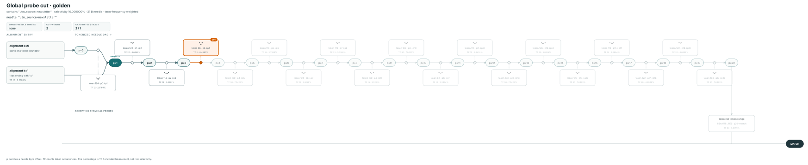

# onpair-graph-viz

Draws how OnPair decides which dictionary tokens to probe for a `LIKE '%pattern%'`
query: the DAG of every way the pattern can lie across token boundaries, and the
minimum weighted vertex cut that becomes the probe cover.



## What the picture says

A row can only contain the pattern if it holds at least one token from the cover,
so rows without one are never decoded. Two things can happen at a match:

* **One token contains the whole pattern.** Those ids are mandatory members of
  every cover. They are deliberately *not* in the DAG — such a match crosses no
  boundary, so no path stands for it and no cut could select it. The figure draws
  them as the teal `MANDATORY` card, railed straight into `MATCH`, because the
  cover they are part of has to add up.
* **The match crosses a boundary.** Then it begins at some feasible first-token
  alignment `k`, and greedy parsing of the rest is deterministic. Each such layout
  is one path from an alignment to an accepting terminal. A **cut** of this DAG is
  therefore exactly a sound cover: whichever layout the occurrence takes, it runs
  into a probe.

Reading the figure:

| element | meaning |
|---|---|
| left column, one card per row | a feasible alignment `k` — `k` needle bytes sit at the tail of the first token; cards are grouped by downstream convergence so parallel branches remain visually separate |
| rounded `p=N` node | parsing has consumed the needle up to byte offset `N` |
| teal filled `p=N`, `merge ×m` | `m` alignments converged here; one probe downstream blocks all of them |
| callout card on an edge | the single interior token greedy parsing takes at that offset |
| card in the bottom row | an accepting terminal: tokens whose prefix is the whole remaining needle; a one-ID prefix range is shown as one point token |
| teal `MANDATORY` card | tokens holding the whole pattern: in every cover, in no cut |
| **orange** outline, `CUT` badge | selected by the cut |
| faded node | downstream of the cut, so unreachable once the cover is in place |
| `TF` | token occurrences in the code stream |
| `DF` | rows holding the token; shown only under a `df` metric, the only time it is counted |

The **cut** is a set of DAG nodes and the **cover** is what the scan compares
against. They are not the same set, which is why the two chips are named apart:

| chip | what it counts |
|---|---|
| `WHOLE-NEEDLE TOKENS` | the mandatory ids, which no cut can select |
| `CUT WEIGHT` | the min-cut objective. Zero means no occurrence crosses a token boundary in this column — not that nothing matches |

So a cut of three nodes can compile to a cover of ten probes, and a cut of weight
zero can still leave a cover with real work to do — both of which are figures this
tool draws, and both of which read as errors until the two are kept apart. The
cover itself — surviving cut ids plus the mandatory ones, merged into maximal runs,
one probe per run — is what the picture shows; its counts are in the JSON and on
the CLI line rather than in a chip.

Why a *global* cut rather than the cheapest probe per alignment: local choices pay
twice for alignments that converge, when one probe at the join blocks both, and
they weigh a first-token set against a single terminal when picking that set would
have obviated all of them. A cut has neither blind spot because it is not making a
sequence of local choices at all.

## Input

Anything that is an OnPair column. The library takes a `ColumnView` and the
`TokenFrequencyIndex` built for it — no dataset, benchmark, or workload is baked
in:

```rust
let view = column.view();
let frequencies = build_token_frequency_index(view.codes, view.dict.num_tokens())?;
let figure = visualize(view, &frequencies, b"utm_source=", &Options::default())?;
std::fs::write("figure.svg", figure.svg.unwrap())?;
```

`Figure` also carries the graph, the cut, the cover's point/range shape, and the
measurements below — it serializes to JSON as-is.

The binary is glue for the common case, turning a text file into a column:

```console
$ cargo run --release -- \
    --rows urls.txt --title "clickbench urls" --out figures --gallery \
    --pattern 'utm_source=newsletter' --pattern '/cart/checkout'
column: 40000 rows, 181659 codes, 937 dictionary tokens
  01-utm-source-newsletter: 4 alignments, cut 3 probes weight 2432 · cover 4 comparisons (0 whole-needle) · 2289 candidates (866 exact), onpair 2289, sound true
  02-cart-checkout: 3 alignments, cut 3 probes weight 4431 · cover 5 comparisons (1 whole-needle) · 5571 candidates (5571 exact), onpair 5571, sound true
```

One row per line; `--rows -` reads stdin. `--help` lists the rest: `--metric` for
the cut objective (`tf`, `tf_residual`, `df`, `df_residual`), `--pattern-hex` for
non-UTF-8 needles, `--no-measure`, `--max-states`.

It can also consume the benchmark's canonical Arrow dataset and render a whole
query catalog into the compact bundle embedded by Benchmark Explorer 3000™:

```console
$ cargo run --release -- \
    --dataset ../../datasets/clickbench-url-1m \
    --queries ../../suites/clickbench-url-1m-contains-s42/queries.jsonl \
    --bits 16 --no-measure --bundle /tmp/clickbench-mincut-graphs.json
```

New ABI-v7 benchmarks export the exact compact dictionary and cumulative token
frequency index in a deterministic replay after the complete timing matrix.
Prefer that sidecar: it does not retrain during visualization, does not require
the original dataset, and its decoder checks the embedded versioned fingerprint
before drawing anything:

```console
$ cargo run --release -- \
    --artifact ../../results/my-run/artifacts/onpair_spiral-c0-d0-rows0-chunk0.lbartifact \
    --queries ../../suites/clickbench-url-1m-contains-s42/queries.jsonl \
    --no-measure --bundle /tmp/clickbench-mincut-graphs.json
```

Only substring operations are included. Multi-needle queries get one graph per
needle under the same query id. For dataset reconstruction, `--bits`,
`--threshold`, and `--seed` must match the candidate configuration whose cover
facts the figure explains; sidecars need none of those flags. Explorer
bundles include an `onpair-mincut-v1` fingerprint over the ordered token bytes
and every token's frequency. Sidecars embed and validate that same identity;
legacy benchmark rows use recorded cover facts (and a fingerprint when one is
available) to reject a graph reconstructed from the wrong dictionary.

## It checks itself

This crate rebuilds the DAG instead of reading OnPair's. That is on purpose —
OnPair's planner keeps only ids and weights because it runs per query, while a
figure needs token strings, provenance and labels, and the library must not carry
that. The cost is a second implementation of the same logic, which could drift and
draw something false.

So every figure is measured against the column it came from: candidate rows the
cover admits, true matches by decode-and-search, and what OnPair's own
`prefilter_candidates` admits for the same pattern. `sound` is false if any true
match fell outside the cover, and the binary exits non-zero when that happens.
Differing candidate counts are reported but not treated as failure — several cuts
can tie on weight, and both would be sound.

That check has a blind spot, and it is worth knowing where. It compares *rows*, so
it catches any divergence that changes which rows are admitted — but not one that
only changes the probe shape or its comparison price. `live_cover` therefore
mirrors the pinned planner's normalization directly: membership is preserved,
maximal runs become ranges, and each range costs two SIMD comparisons.

**So when the shared `onpair` pin in `tools/onpair-artifact/Cargo.toml` moves,
re-read the planner.** The two
functions this crate copies from it are flagged at their definitions:
`graph::live_cover` (run merging and comparison pricing) and `mincut`.

## Notes

* **Size guard.** Each byte-offset state is about 148 units of width, so a long
  needle produces a technically valid and practically useless figure. Past
  `--max-states` (default 128) the JSON is still written and the SVG is skipped.
* **Fonts.** The SVG is self-contained — inline styles, no external references —
  but names a system font stack rather than embedding a face. Card widths are
  fixed, so a viewer without Inter or a similar UI font may set text slightly
  wider than the layout assumed. Embedding a face would add roughly 200 KB per
  figure; converting to PDF once at publication time is the better trade.
* **Golden figure.** `tests/golden/newsletter.svg` is byte-compared on every test
  run. Regenerate with `UPDATE_GOLDEN=1 cargo test`, and open the diff — a layout
  regression looks exactly like a layout improvement until someone does.
* **One producer/consumer pin.** Both this crate and the `onpair_spiral`
  candidate depend on `tools/onpair-artifact`, which owns the OnPair revision,
  fingerprint, and sidecar codec. Updating one cannot leave the other silently
  compiling against an older library.
